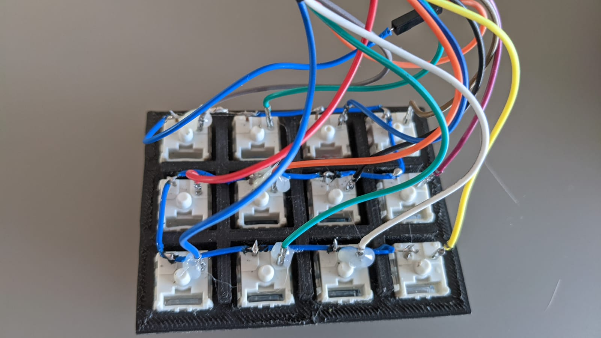
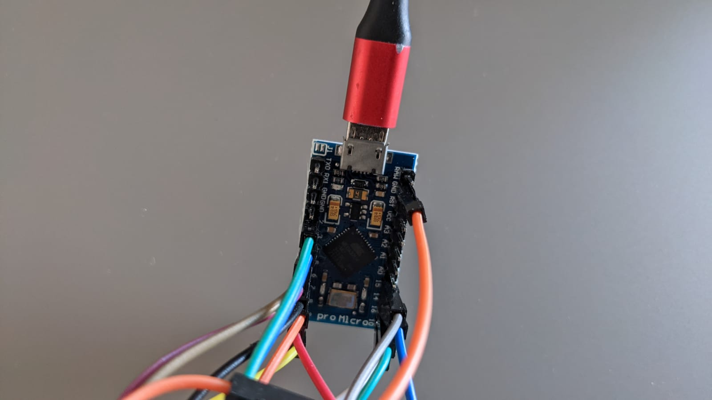
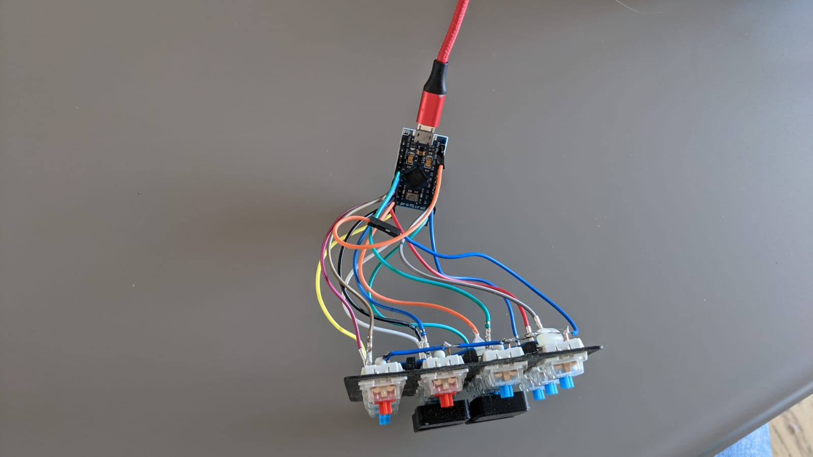
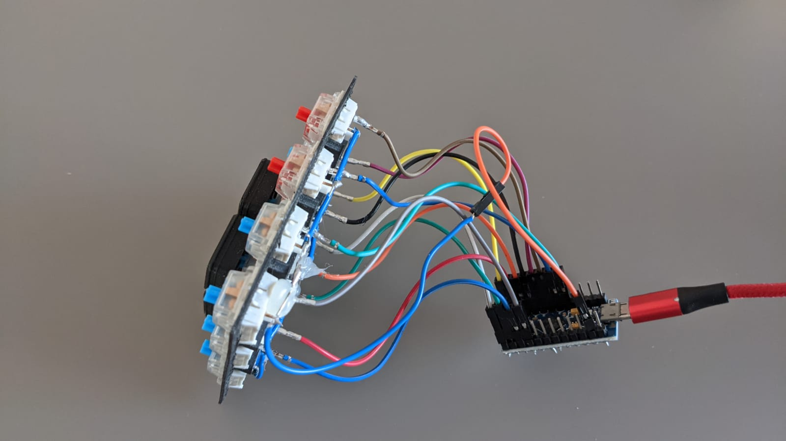
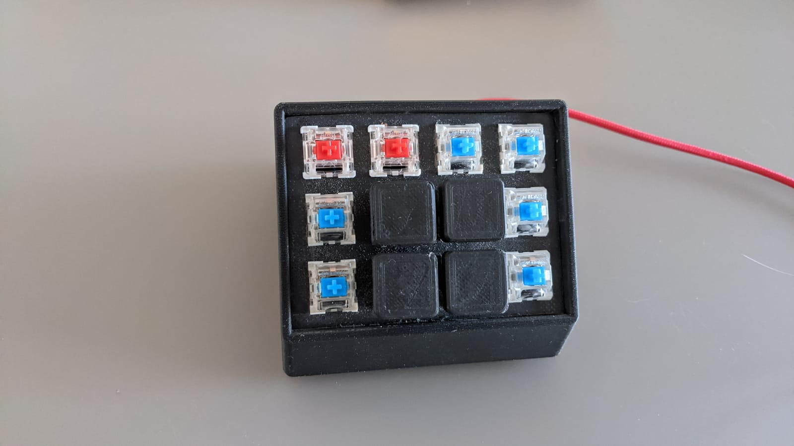

# Shortcut Keyboard

Small scriptable keyboard created with a 3d Printer, an Arduino Micro Pro and a tiny bit of code

## Images:
Switches back:

Arduino Board:

Circuit:

Circuit 2:

Keyboard:

## 3d Resources files

Stream Deck/ Marco Keyboard [Stream-deck](https://www.thingiverse.com/thing:4186055)
The keycaps I ended up using [Keycap](https://www.thingiverse.com/thing:738769)